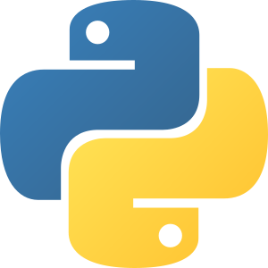
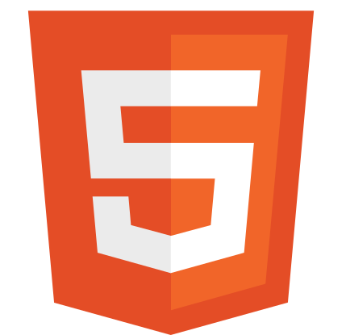
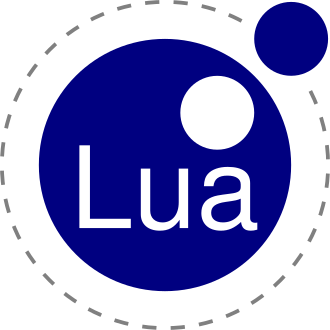
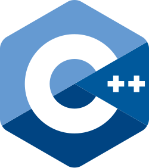

<h3>Hi, im <b>GAB644</b></h3>
i draw and code. but i dont code a lot, and i code just for fun.
 <a href="https://sites.google.com/view/gab644/information"><b>More Information about me</b></a>

<h3>I code in</h3>

<h3>Sick ass projects i made</h3>
<a href="https://github.com/GAB644/RPS-Python">RPS! Python</a>
